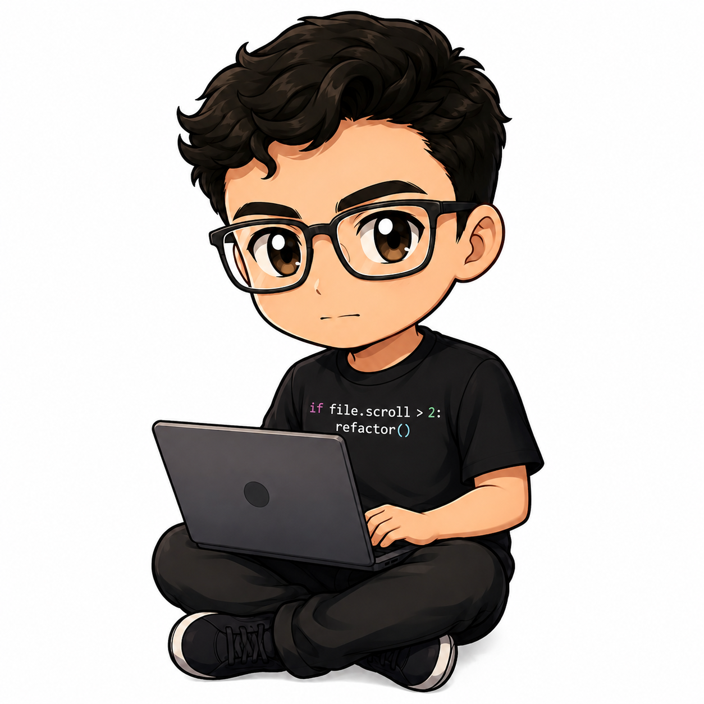

<div align="center">



<br/>

# Luan Henrique Martins da Silva

**AI Engineering · Python · Full-Stack Web**

[](https://unuskawnai.com)
[](https://linkedin.com/in/luan-martins5533)
[](mailto:luanmar5533@gmail.com)
[](https://github.com/Luan-Martins76)

`Itaguaru, GO — Brazil`

</div>

---

## About

AI Engineering student focused on **Machine Learning, LLMs, and hybrid system design**.

I build systems that combine deterministic rule engines with local language models — getting the reliability of classical logic and the flexibility of LLMs in the same pipeline. My main concern is making AI behavior auditable, predictable, and actually useful in production, not just impressive in demos.

Beyond architecture, I ship complete products: REST APIs, multimodal pipelines, session-scoped memory systems, and full frontends — all handcrafted without CSS frameworks.

---

## Tech Stack

**Languages & Runtimes**


**AI / ML**


**Backend & Infrastructure**


---

## Featured Projects

### Sulivan — Institutional AI Chatbot `v4.0`

> Assistente virtual da UniEVANGÉLICA · Arquitetura híbrida · Multimodal

[](https://unuskawnai.com/Sulivan/templates/index.html)
[](https://github.com/Luan-Martins76/Sulivan)

A production-grade conversational assistant built for a Brazilian university. The core decision was architectural: instead of routing everything through the LLM, the system uses a **rule engine as the primary handler** for structured institutional data (schedules, calendars, contacts) — guaranteeing deterministic, zero-hallucination answers where it counts most. The LLM is invoked only as a fallback for open-ended queries.

**Decision pipeline:**

```
incoming message
    ├── rule engine (keyword matching)  →  deterministic answer
    └── LLM fallback
          ├── memory:   mistral-nemo:12b  →  structured context summary (last 20 msgs)
          ├── response: gemma3:4b         →  natural language generation
          └── emergency: baseado_regras   →  static fallback pool
```

**Multimodal input pipeline:**

| Type | Primary Strategy | Fallback |
|------|-----------------|---------|
| Image (PNG/JPG/GIF/WEBP) | EasyOCR — text extraction | `llava-llama3` — visual description |
| PDF | `pdfplumber` — direct extraction | `pdf2image` + EasyOCR (scanned) |
| Word (.docx) | `python-docx` — native parsing | Extraction failure warning |
| Plain text (.txt) | Direct UTF-8 read | — |

**REST API surface:**

```
POST   /chat           →  text message; returns response + source + memoria_atualizada
POST   /chat/arquivo   →  multipart/form-data; accepts image, PDF, DOCX, TXT
GET    /historico      →  user message history (chronological)
DELETE /historico      →  wipe user history
POST   /login          →  session-based authentication
POST   /cadastro       →  account creation
GET    /health         →  healthcheck { "status": "ok" }
```

**Technical highlights:**
- Session-scoped memory cache; auto-regenerated every 5 user messages
- `keep_alive: 0` for active VRAM management on constrained hardware (RTX 4050 mobile)
- bcrypt password hashing via Werkzeug; `SECRET_KEY` loaded from `.env`
- Institutional knowledge base in plain JSON — updatable without touching Python
- Modular frontend (v3.0): `chat.js`, `index.js`, `login.js`, `mini_chat_home.js`
- Calendar view with canvas universe animation + `postMessage` iframe bridge

`Python` `Flask` `Ollama` `gemma3:4b` `mistral-nemo:12b` `llava-llama3` `EasyOCR` `SQLite` `pdfplumber` `python-docx` `Vanilla JS`

---

### Portfolio — unuskawnai.com
> Zero framework. Built from scratch.

Personal portfolio and deployment host for Sulivan's public frontend. Every layout rule, animation, and interaction written by hand — including a Three.js/WebGL Earth with canvas-based star field and custom domain + full deploy pipeline.

`HTML5` `CSS3` `JavaScript` `Three.js` `WebGL`

---

## GitHub Stats

<div align="center">


</div>

<div align="center">


</div>

---

## Currently

- 🔬 Sulivan v4.0 — pipeline multimodal com `llava-llama3` em produção
- 📐 Estudando system design para IA confiável — explicabilidade e controle de alucinação
- 🎓 Bacharelado em Inteligência Artificial @ UniEVANGÉLICA

---

<div align="center">

**Vamos construir algo juntos.**

Trabalho com IA generativa, arquiteturas híbridas e sistemas que precisam ser inteligentes e confiáveis ao mesmo tempo.

[](mailto:luanmar5533@gmail.com)
[](https://linkedin.com/in/luan-martins5533)

</div>

---

<div align="center">Let's build something together.

I work with generative AI, hybrid architectures, and systems that need to be intelligent and reliable at the same time.

 

</div># Luan-Martins76
